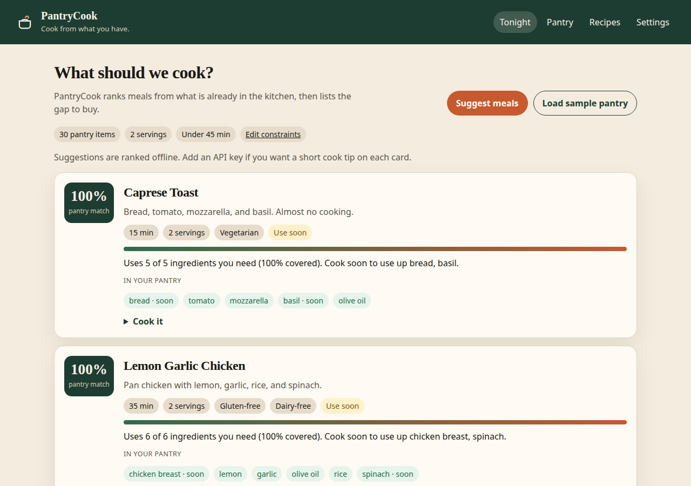
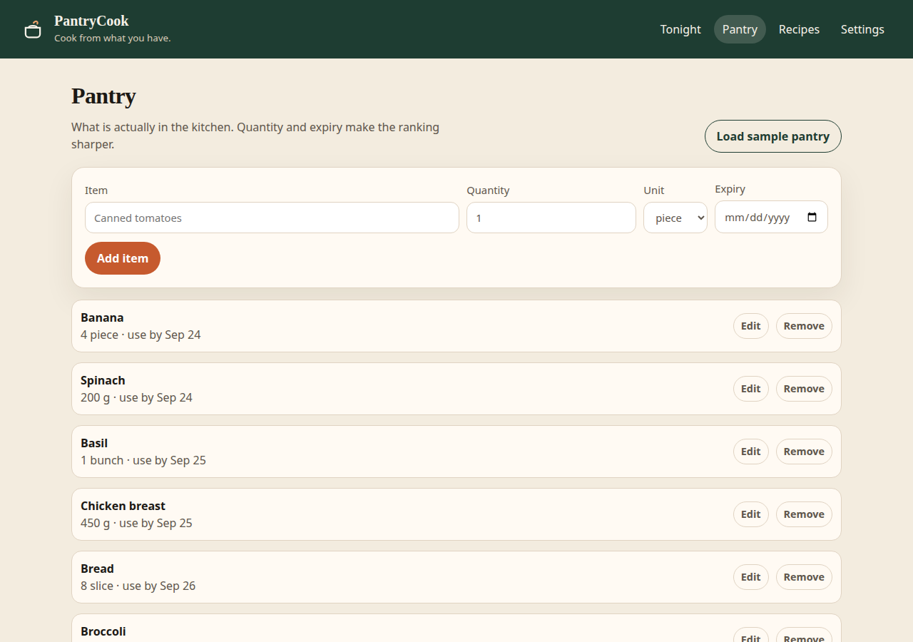
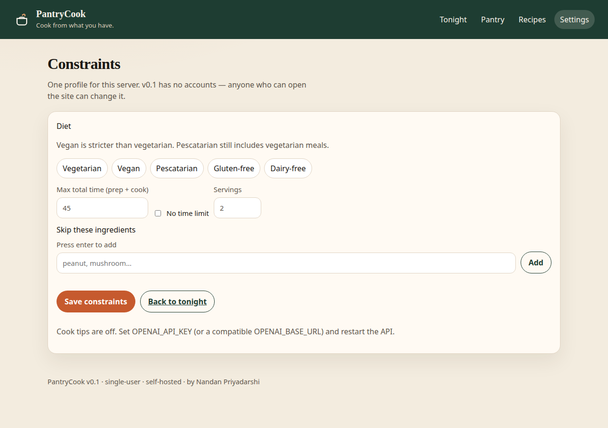

# PantryCook

**Cook from what you have.** · [Nandan Priyadarshi](https://github.com/nandanosql)



| Pantry | Settings |
| --- | --- |
|  |  |

- Ranks meals from what is already in the kitchen, and lists the shopping gap.
- Filters by diet, time, servings, and ingredients you will not use.
- Self-hosted with Docker Compose. SQLite by default. No account in v0.1.

## Quick start

```bash
git clone https://github.com/nandanosql/pantrycook.git
cd pantrycook
cp .env.example .env
docker compose up --build
```

- Web: http://localhost:3000
- API: http://localhost:8000

Open the site, choose **Load sample pantry**, then **Suggest meals**. Seed recipes load on first boot when the library is empty. v0.1 is single-user and has no login, so keep the host on a private network.

## How suggest works

The matcher in `backend/app/services/matcher.py` always runs offline. It drops recipes that miss a diet rule, run past the time limit, or use an excluded ingredient, then scores the rest by how much of each required ingredient you already have. Food that expires within three days gets a small boost. Optional ingredients never count against you.

Set `OPENAI_API_KEY` for a one- or two-sentence cook tip on each card. `OPENAI_BASE_URL` and `OPENAI_MODEL` are optional. With no key, or if that call fails, the ranking still works and the tip stays empty.

## Stack

- **API:** Python 3.12, FastAPI, SQLAlchemy, Pydantic
- **Web:** Vue 3, Vite, nginx in the container
- **Data:** SQLite by default. Set `DATABASE_URL` to a Postgres URL (`postgresql+psycopg://...`) to use that instead. The driver is included.

## Roadmap

- **v0.2** — import a recipe from a URL
- **v0.3** — photo pantry (picture to items)
- **v0.4** — households and accounts
- **v0.5** — cook mode with timers and step help

## Contributing

Issues and pull requests are welcome. See [CONTRIBUTING.md](CONTRIBUTING.md).

## License

[MIT](LICENSE). Copyright (c) 2026 [Nandan Priyadarshi](https://github.com/nandanosql).
