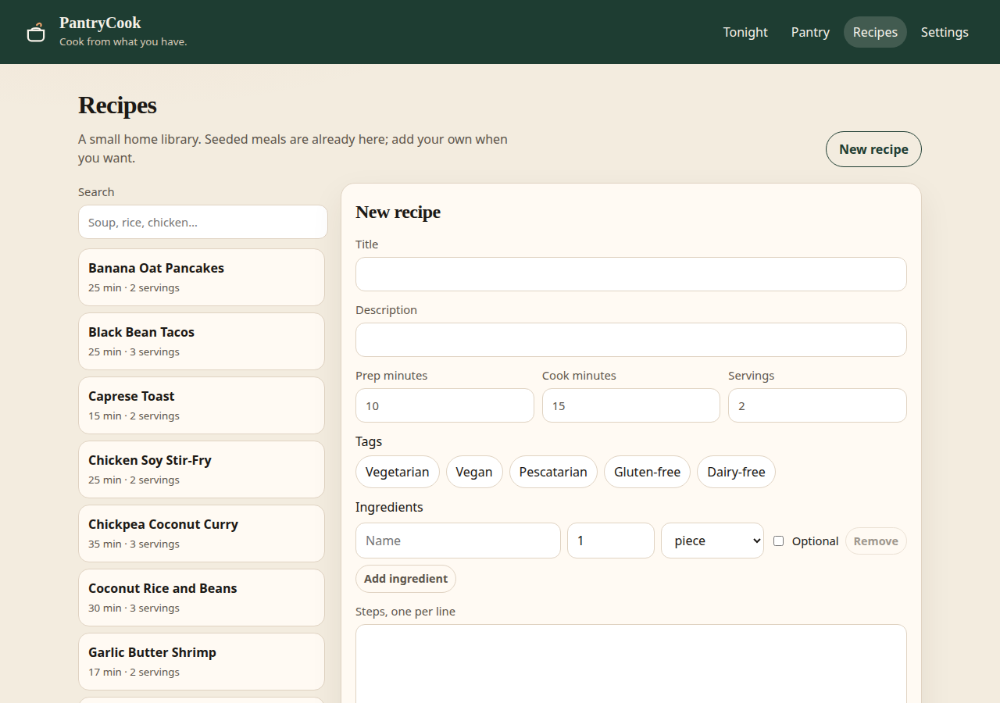

# PantryCook

**Cook from what you have.**

PantryCook is a self-hosted, open-source meal app. You tell it what is in the kitchen and what you will not cook tonight. It ranks meals you can make, shows what you are missing, and writes the shopping gap.

It is pantry-first. A recipe library is useful, but it does not decide dinner.

Built by [Nandan Priyadarshi](https://github.com/nandanosql).

## The problem

Home cooks already know a handful of meals. The hard part is matching those meals to the food that needs using, the time you have, and the ingredients you are avoiding. PantryCook is that decision, on your own machine.

- Rank meals by how much of each recipe is already in the pantry, with a boost for food that expires soon.
- Runs fully offline. If you set an API key, each suggestion can include a short cook tip.
- One Docker Compose command. SQLite by default, no account system in v0.1.

## Quick start

```bash
git clone https://github.com/nandanosql/pantrycook.git
cd pantrycook
cp .env.example .env
docker compose up --build
```

| Surface | URL |
| --- | --- |
| Web | http://localhost:3000 |
| API | http://localhost:8000 |
| Health | http://localhost:8000/health |

Open the web app, choose **Load sample pantry**, then **Suggest meals**. Seed recipes load on first boot when the recipe table is empty. The SQLite file lives in the `pantrycook-data` volume at `/data/pantrycook.db`.

v0.1 is **single-user and has no authentication**. Anyone who can reach the site can change the pantry. Do not put it on the public internet without a reverse proxy and access control you trust.

### Local development

API (Python 3.12):

```bash
cd backend
python -m venv .venv
source .venv/bin/activate
pip install -r requirements.txt
uvicorn app.main:app --reload --port 8000
```

Web (the dev server proxies `/api` to port 8000):

```bash
cd frontend
npm install
npm run dev
```

Vite serves the UI at http://localhost:5173. Tests:

```bash
cd backend
pytest -q
```

## Stack

- **API:** Python 3.12, FastAPI, SQLAlchemy, Pydantic
- **Decision engine:** `backend/app/services/matcher.py` (always on) and `backend/app/services/llm.py` (optional)
- **Web:** Vue 3, Vite, nginx in the container
- **Data:** SQLite by default. Set `DATABASE_URL` to a Postgres URL (`postgresql+psycopg://...`) if you want that instead. The driver is included.

## How suggest works

`POST /suggest` reads the current pantry and the single constraint profile, then:

1. Drops recipes that miss a diet rule, run longer than the time limit, or use an excluded ingredient. Vegan is stricter than vegetarian. Vegetarian meals still count as pescatarian. Vegan meals count as dairy-free. Gluten-free is only true when the recipe is tagged that way.
2. Scores the rest by how much of each required ingredient you already have. Grams, millilitres, and spoons convert. Optional ingredients never count against you. If the units cannot be compared, a name match still counts, but the shopping line says to check the amount.
3. Adds a small boost when a matched ingredient expires within three days, so food you should use up ranks higher.
4. Returns the top meals with a score, matched ingredients, missing ingredients, a shopping delta scaled to your serving count, and a short explanation.
5. If `OPENAI_API_KEY` is set, asks an OpenAI-compatible chat endpoint (`OPENAI_BASE_URL`, `OPENAI_MODEL`) for a one- or two-sentence tip. A missing key, or a failed call, leaves `llm_tip` empty. The ranking still works.

Other routes: `GET /health`, full CRUD on `/pantry` and `/recipes`, and `GET`/`PUT /constraints`. `POST /pantry/sample` loads a demo kitchen without duplicating items you already stored.

## Roadmap

- **v0.2** — import a recipe from a URL
- **v0.3** — photo pantry (picture to items)
- **v0.4** — households and accounts
- **v0.5** — cook mode with timers and step help

Photo pantry and multi-user accounts are intentionally out of v0.1.

## Screenshots





## Contributing

See [CONTRIBUTING.md](CONTRIBUTING.md). Issues and pull requests are welcome. The license is MIT.

## Layout

```
backend/          FastAPI app, matcher, seed recipes, pytest
frontend/         Vue 3 SPA
docs/             getting started stub
screenshots/      screenshot notes
docker-compose.yml
```
